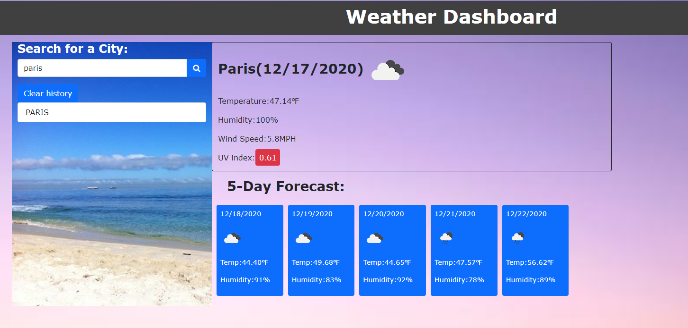
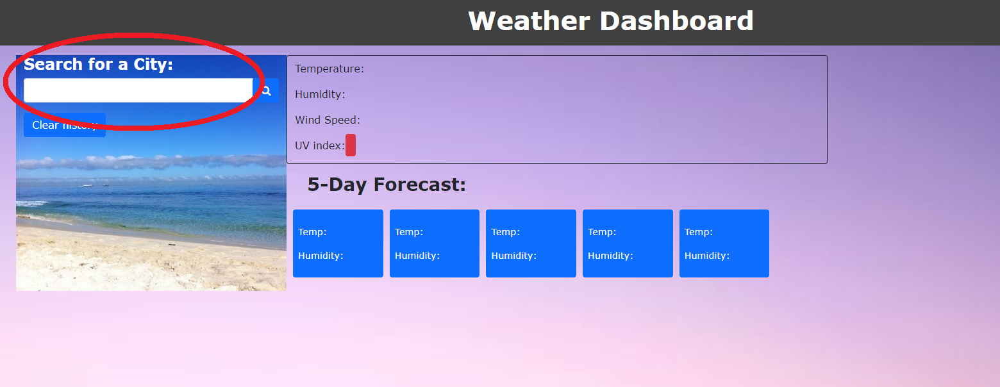

# Weather Dashboard
This is a web app to find weather condition of a certain city ( by searching the city in a text box). It will also shows the five days forecast for that place.
The localStorage is also used for storing the search city or place data locally and it will be loaded when the page is loaded and one can clear the localstorage by clicking on local storage

This has been deployed to GitHub. To get this web app ( or project) up and running, one can follow the link(deployment).one can also download the file to use as template.
 
* [GitHub Repository](https://github.com/citenaresh/Weather-Dashboard/): https://github.com/citenaresh/Weather-Dashboard/
* [Deployed GitHub IO](https://citenaresh.github.io/Weather-Dashboard/index.html): https://citenaresh.github.io/Weather-Dashboard/index.html

The screenshot of the Weather Dashboard :

### project's Summary
This is a web app to find weather condition of a certain city ( by searching the city in a text box). It will also shows the five days forecast for that place.

* The user will be presented with a input box (aka textbox) and when a proper place name is entered and click on the search button

then current weather as well as five days forecast will be displayed in the page

The current weather section includes the following items:
* City, Date, Icon-image
* Temperature
* Humidity
* Wind Speed
* UV index
The five day forecast section shows the following:
* Date
* Icon image
* Temperature
* Humidity

### The Details: 

* When the user opens the page, the “loadlastCity” function is fired up which will fetch the stored cities from the local storage and  the “addToList” function will display the cities in the search history . The last searched city is then pass as a parameter in the “currentWeather” function and run the function for that city.
* currentWeather" function is passed the city as an argument to show the weather information about that city. Ajax call is made to the Open Weather API, by including the city and the API Key in the search query.  If the call is a success than the weather information will be returned in "response” data object. 
* "UVIndex" function returns the UV Index of the city. To get UVindex another AJAX call is made in the "UVIndex" function by including the latitude and longitude information in the query URL. And uv index for that city is shown on the page. 
* "forecast" function is called with the city id. When the ajax, call was success, the cities will be grabbed from local storage. If there are no entries in the local storage, the city will be stored in the storage and also will be shown on the page where the search history is displayed. If there are entries in the storage, by using "find" function, we will search the entries from the storage to see if the city exists; if it exists, to prevent double entry, it won't be added to the storage or the page. If it does not previously searched, then it will be added to the storage and the page.
* Finally when the user enters the city name  in the input box and press search button, “displayWeather” function will be called and current weather function will be call to display the current and 5-days forecast weather condition on the page.

### How To Execute the Files:
> The files should be Open in browser.

### Features: 
* HTML Page
    * Index.html 
        The main UI design
* CSS file
    * styles.css
         for the style of the page (index.html)
* Javascript file
         script.js for loading the Weather Dashboard and saving and displaying from localstorage

## Authors

* **Naresh Raj Poudel** - [Git Hub Profile](https://github.com/citenaresh): https://github.com/citenaresh

## Acknowledgments

* Great gratitude to Luca ([https://github.com/duvet86](https://github.com/duvet86)), Sam ([https://github.com/sam-ngu](https://github.com/sam-ngu)) and Renata from the UWA Bootcamp for their enormous help.